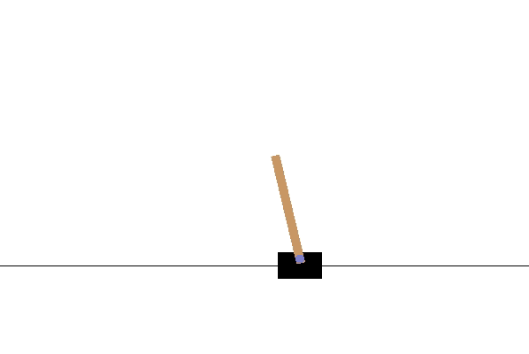

# Generative Adversarial Imitation Learning for OpenAI Gym environments

This repository provides a **TensorFlow 2.x** implementation of 
**Generative Adversarial Imitation Learning (GAIL)** and 
**Behavioural Cloning (BC)** for the classic 
**CartPole-v0, MountainCar-v0, and Acrobot-v1** environments from OpenAI Gym. 
(based on<a href="https://arxiv.org/abs/1606.03476">
<b>Generative Adversarial Imitation Learning,</b></a> 
Jonathan Ho & Stefano Ermon.) It uses PPO (recommended) or SARSA to generate experts.


## Dependencies
- <b>python: 3.8.10</b>
- **pyglet: 1.5.21**
- <b><a href="https://www.tensorflow.org/">TensorFlow: 2.6.0 </a></b>
- <b><a href="https://github.com/openai/gym">gym: 0.21.0 </a></b>
- **ffmpeg** (for SARSA)

## Gym environments
- **CartPole-v0**
- **MountainCar-v0**
- **Acrobot-v1**

For all of these environments:
- State: <b>Continuous</b>
- Action: <b>Discrete</b>

## GAIL:

### General notes

**Important**: Ensure that your working directory is `gail-ppo-tf-gym`. 
This will affect how model checkpoints and other important files are saved.

Use `python3 {}.py --help` for help with any file arguments.

### Note about 'experts'
High performing models are considered 'experts'. 
The expert thresholds for each environment are as follows:

- CartPole-v0: score of >=195 in 100 consecutive rollouts of policy (from OpenAI)
- MountainCar-v0: score of >=-110 in 100 consecutive rollouts of policy (from OpenAI)
- Acrobot-v1: score of >=-100 in 100 consecutive rollouts of policy (chosen based on known algorithms' performance)

Except SARSA (which is always rendered), the environment will only be 
rendered if the agent passes the 'expert' threshold in at least one iteration.
BC is never rendered.

BC and SARSA will always save their models when run. GAIL and PPO by default will only save their models
if the policy reaches expert performance. This can be bypassed with the `--force_save_final_model` flag.

### Step 1: Generate expert trajectory data  
**PPO** or **SARSA** can be used to generate the expert trajectory data. First, train the expert model with `run_ppo.py` or `run_sarsa.py`.
```
python3 run_ppo.py --env CartPole-v0
```

```
python3 run_sarsa.py --env CartPole-v0
```

<p align= "center">
  
</p>

For PPO, if the algorithm prints `Clear!! Model saved.` then we have passed the expert threshold for this task, 
and we can continue. A CartPole-v0 expert is already saved in this repo under `trained_models/ppo`. 
SARSA experts for all three environments are saved under `trained_models/sarsa`, and are python pickle
files which store a tuple of `(theta, rnd_seq)` which parameterizes the trained SARSA model.
For SARSA, the model will always be saved.

### Step 2: Sample the expert trajectory data from the PPO/SARSA generated trajectories.
All trained models are saved under `trained_models/{name_of_algo}/model_{env_name}.ckpt`.
For example:

```
python3 sample_trajectory.py --env CartPole-v0 --model trained_models/ppo/model_CartPole-v0.ckpt
```
```
python3 sample_trajectory.py --env CartPole-v0 --model trained_models/sarsa/model_CartPole-v0.ckpt
```

This step should save the expert's (PPO policy's) observations and actions under:

- trajectory/observations_{env_name}.csv
- trajectory/actions_{env_name}.csv

GAIL will expect that these observations and actions are stored here.

### Step: 3.1 Execute Imitation Learning - GAIL.
Train GAIL on PPO expert:
```
python3 run_gail.py --env CartPole-v0 --trajectorydir trajectory/ppo
```
<p align= "center">
  
</p>

Train GAIL on SARSA expert:
```
python3 run_gail.py --env CartPole-v0 --trajectorydir trajectory/sarsa
```
<p align= "center">
  
</p>

### Step: 3.2 Run behavioral cloning
Run BC on PPO expert:
```
python3 run_behavior_clone.py --env CartPole-v0 --trajectorydir trajectory/ppo
```

Run BC on SARSA expert:
```
python3 run_behavior_clone.py --env CartPole-v0 --trajectorydir trajectory/sarsa
```

### Step: 4 Test trained policy for GAIL
Running GAIL trained on PPO:
```
python3 test_policy.py --env CartPole-v0 --alg gail/ppo
```
<p align= "center">
  
</p>

Running GAIL trained on SARSA:
```
python3 test_policy.py --env CartPole-v0 --alg gail/sarsa
```
<p align= "center">
  
</p>

### Note: To test the BC policy, specify the _number_ of model.ckpt-[_number_]
For example to test BC on SARSA:  
```
python3 test_policy.py --alg bc/sarsa --model 1000
```

### Sources:
- <a href="https://arxiv.org/abs/1606.03476"><b>Generative Adversarial Imitation Learning,</b></a> Jonathan Ho & Stefano Ermon.
- <a href="https://blog.openai.com/openai-baselines-ppo/"><b>Proximal Policy Optimization by OpenAI.</b></a>
- <b><a href="https://github.com/uidilr/gail_ppo_tf">GAIL with PPO implementation using tensorflow</a></b>
- <b><a href="https://github.com/andrewliao11/gail-tf">GAIL with TRPO & PPO using tensorflow</a></b>
- <b><a href="https://github.com/nav74neet/gail_gym">GAIL with PPO on CartPole-v0 using tensorflow</a></b>